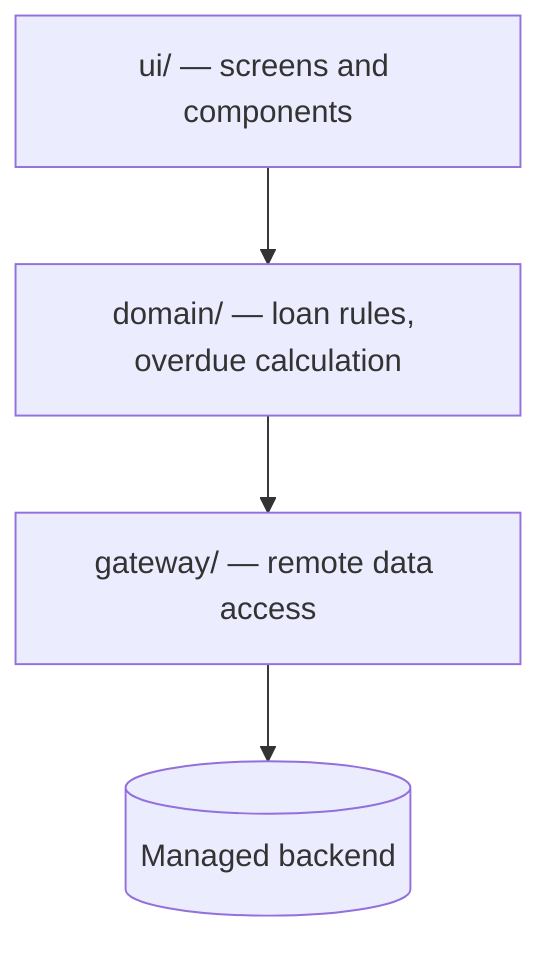
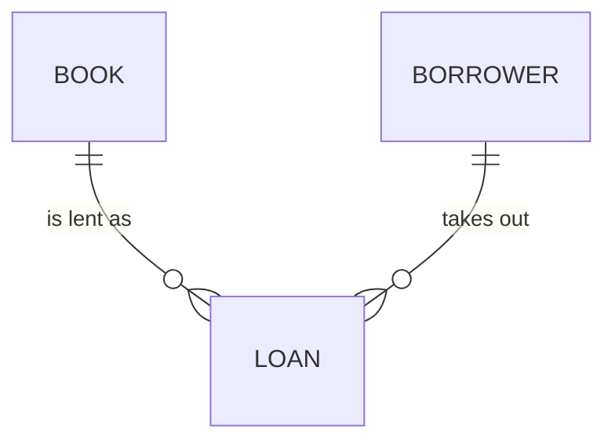

# Architecture Spine — Community Library Borrowing Log

## Design Paradigm

Layered, three layers, dependencies pointing one way only. `ui/` renders and collects input, `domain/` owns loan rules and derived state, `gateway/` is the only module that talks to the backend.



## Invariants & Rules

### AD-1 — A loan's returned state is a timestamp, never a boolean

- **Binds:** all
- **Prevents:** two builders modelling the same fact differently — one as `isReturned: true`, one as `returnedAt`, making the overdue query and the history view disagree.
- **Rule:** the `Loan` entity carries `returnedAt` as a nullable timestamp. Open means `returnedAt == null`. No boolean mirror of this fact may be stored.

### AD-2 — Overdue is computed, never stored

- **Binds:** domain, ui
- **Prevents:** a stored `isOverdue` flag going stale the moment a day passes without a write, so the coordinator's list and the desk view disagree.
- **Rule:** overdue is derived at read time from `dueAt < now && returnedAt == null`. No field, index or cached count may persist it.

### AD-3 — Only the gateway layer knows the backend SDK

- **Binds:** all
- **Prevents:** backend query objects leaking into components, which makes the domain rules untestable and pins the whole app to one provider.
- **Rule:** the backend SDK is imported in `gateway/` only. The gateway returns plain objects typed by `domain/`. Any other module importing it is a build failure.

### AD-4 — The desk is the only writer

- **Binds:** all
- **Prevents:** a second write path — a coordinator screen, an import script — creating loans with different defaults or skipping the due-date rule.
- **Rule:** loans and returns are written through one `domain/` function each. The coordinator view and any import are read-only consumers of the same records.

### AD-5 — Due date is set by the system, not the volunteer

- **Binds:** domain
- **Prevents:** a per-volunteer convention for loan length, which makes the overdue list meaningless.
- **Rule:** `dueAt` is computed on loan creation as a single configured interval from `borrowedAt`. The desk UI exposes no due-date control in the first version.

## Consistency Conventions

| Concern | Convention |
| --- | --- |
| Naming (entities, files, interfaces, events) | Entities singular PascalCase (`Book`, `Loan`, `Borrower`); files kebab-case; one exported function per use case, verb-first (`recordLoan`, `recordReturn`). |
| Data & formats (ids, dates, error shapes, envelopes) | Backend-issued string ids, opaque to the client. All timestamps UTC ISO-8601. Gateway errors are normalised to one `GatewayError` with a `kind` field; raw SDK errors never cross the layer. |
| State & cross-cutting (mutation, errors, logging, config, auth) | No client-side cache of loan state; every view reads current data. No auth in v1 — the app is reachable only from the library's own devices, and the brief explicitly excludes borrower accounts. |

## Stack

| Name | Version |
| --- | --- |
| React | 19.3.0 |
| Vite | 8.3.0 |
| TypeScript | 7.0.2 |
| Parse JS SDK | 8.6.0 |

## Structural Seed

Three core entities, related only as the borrowing log needs them.



```text
src/
  ui/        # screens, components, no backend imports
  domain/    # Loan rules, overdue derivation, types
  gateway/   # the only module importing the backend SDK
```

## Deferred

Borrower identity beyond a name string waits until the library says duplicate names are a real problem — the brief records six volunteers who know the borrowers personally.

Concurrent-edit handling is deferred because the brief lists it as an open question; deciding it now would bind the data model to a scenario nobody has confirmed exists.

Notifications are deferred by scope: the brief puts anything the system sends by itself explicitly out of the first version, so the coordinator's weekly summary is a view, not a job.
